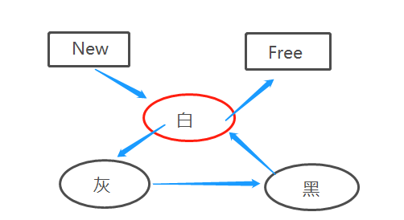
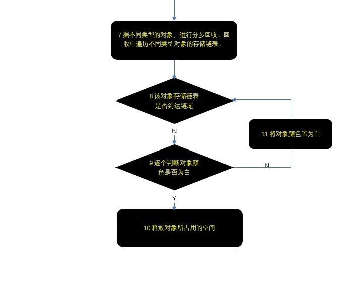

# Lua GC机制分析与理解

---
 
## 1> Lua垃圾回收算法原理简述

- lua采用了标记清除式（Mark and Sweep）GC算法，算法简述： 标记：每次执行GC时，先以若干根节点开始，逐个把直接或间接和它们相关的节点都做上标记； 清除：当标记完成后，遍历整个对象链表，把被标记为需要删除的节点一一删除即可。

---
## 2> Lua垃圾回收中的三种颜色

> “算法简述”提到过的标记，lua用白、灰、黑三色来标记一个对象的可回收状态。(白色又分为白1、白2)

- **白色**：可回收状态。 (未标记待访问，标记待回收)
  - 详解：如果该对象未被GC标记过则此时白色代表当前对象为待访问状态。
  - 举例：新创建的对象的初始状态就应该被设定为白色，因为该对象还没有被GC标记到，所以保持初始状态颜色不变，仍然为白色。如果该对象在GC标记阶段结束后，仍然为白色则此时白色代表当前对象为可回收状态。但其实本质上白色的设定就是为了标识可回收。
- **灰色**：中间状态。（已访问待标记）
  - 详解：当前对象为待标记状态。
  - 举例：当前对象已经被GC访问过，但是该对象引用的其他对象还没有被标记。
- 黑色：不可回收状态。（标记不可回收）
  - 详解：当前对象为已标记状态。
  - 举例：当前对象已经被GC访问过，并且对象引用的其他对象也被标记了。（表示有引用关联）
 
> 备注：白色分为白1和白2。
  - 原因：在GC标记阶段结束而清除阶段尚未开始时，如果新建一个对象，由于其未被发现引用关系，原则上应该被标记为白色，于是之后的清除阶段就会按照白色被清除的规则将新建的对象清除。这是不合理的。
  - 于是lua用两种白色进行标识，如果发生上述情况，lua依然会将新建对象标识为白色，不过是“当前白”(比如白1)。而lua在清扫阶段只会清扫“旧白”(比如白2)，在清扫结束之后，则会更新“当前白”，即将白2作为当前白。下一轮GC将会清扫作为“旧白”的白1标识对象。通过这样的一个技巧解决上述的问题。如下图：(下图中为了方便颜色变换的理解，没有考虑barrier的影响)
  
- 

---
## 3> Lua垃圾回收详细过程

---
//详解待研究